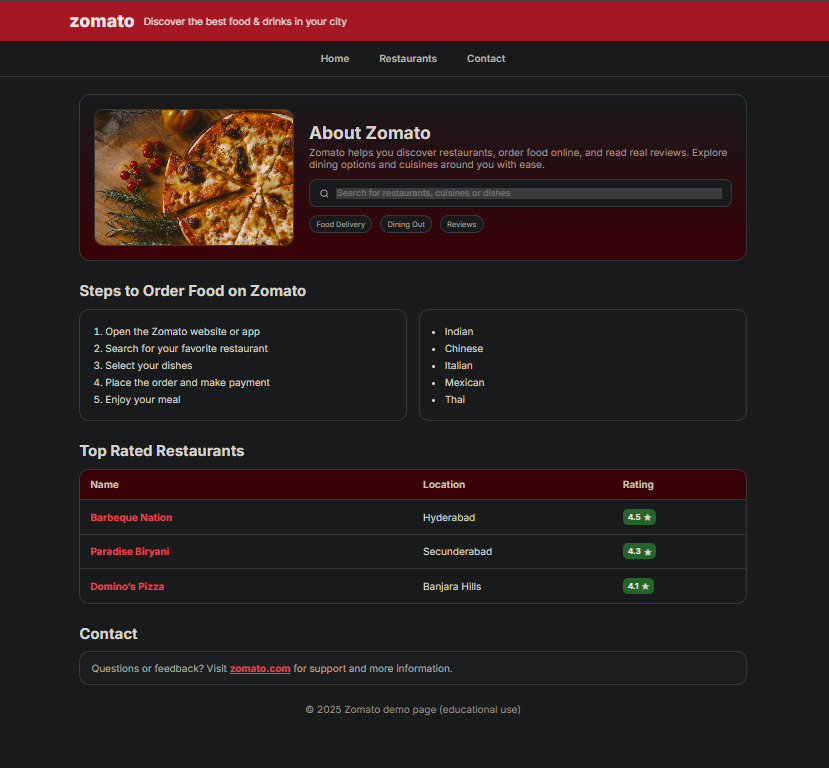

# Zomato-clone
Basic clone page of zomato

This is my **Zomato Clone project**, built as part of my **Web Tech Workshop Assignment**.  
The goal was simple: take a real-world website that we all know (Zomato) and try to recreate its feel from scratch using just **HTML & CSS** (and a little JavaScript, if needed).  

It’s not a production-level site, but it’s my way of showing what I’ve learned about **web design, layouts, responsiveness, and clean coding**.  

---

## What’s Inside  

- A homepage inspired by Zomato’s design  
- A navigation bar (Home, Restaurants, Contact)  
- A section to highlight restaurants with names, images, and ratings  
- Ordered & unordered lists for menus/categories  
- A table showing “Top Rated Restaurants”  
- Responsive design that works on desktop & mobile  

---

## Tech Stack  

- **HTML5** → for structure  
- **CSS3** → for styling and responsiveness  
- **JavaScript** → for small interactions (planned for future updates)  

---

## Sneak Peek  



---

## Project Structure  

```bash
Zomato-clone/
│
├── index.html      # Main page
├── style.css       # Styling
├── script.js       # (optional, for future features)
└── README.md       # This file

---
